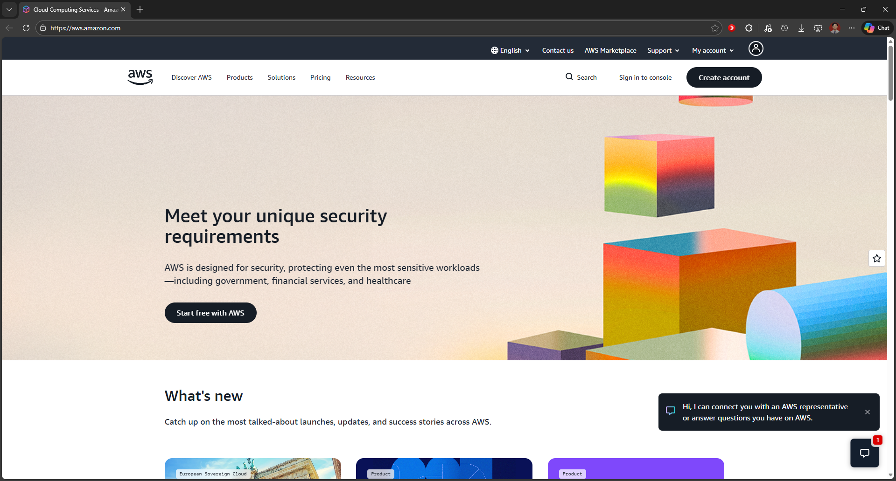
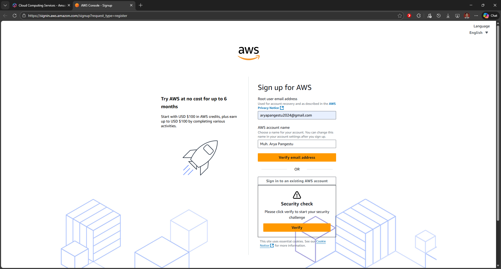
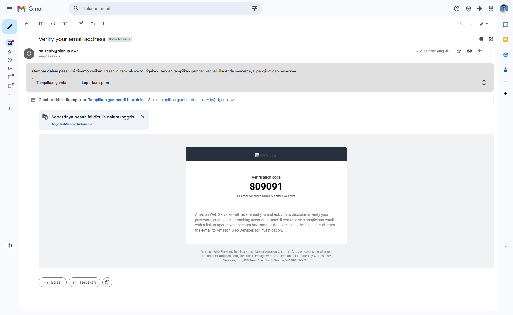
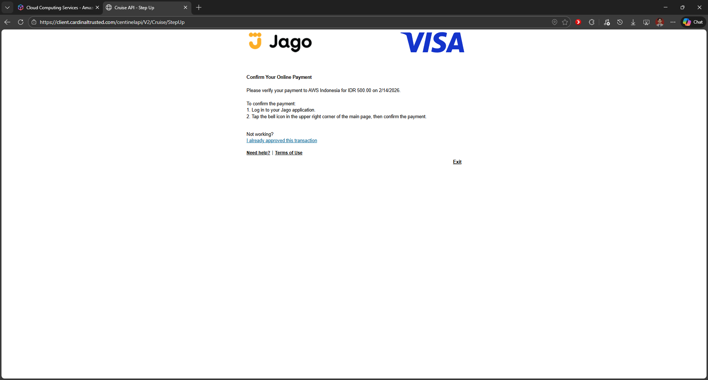
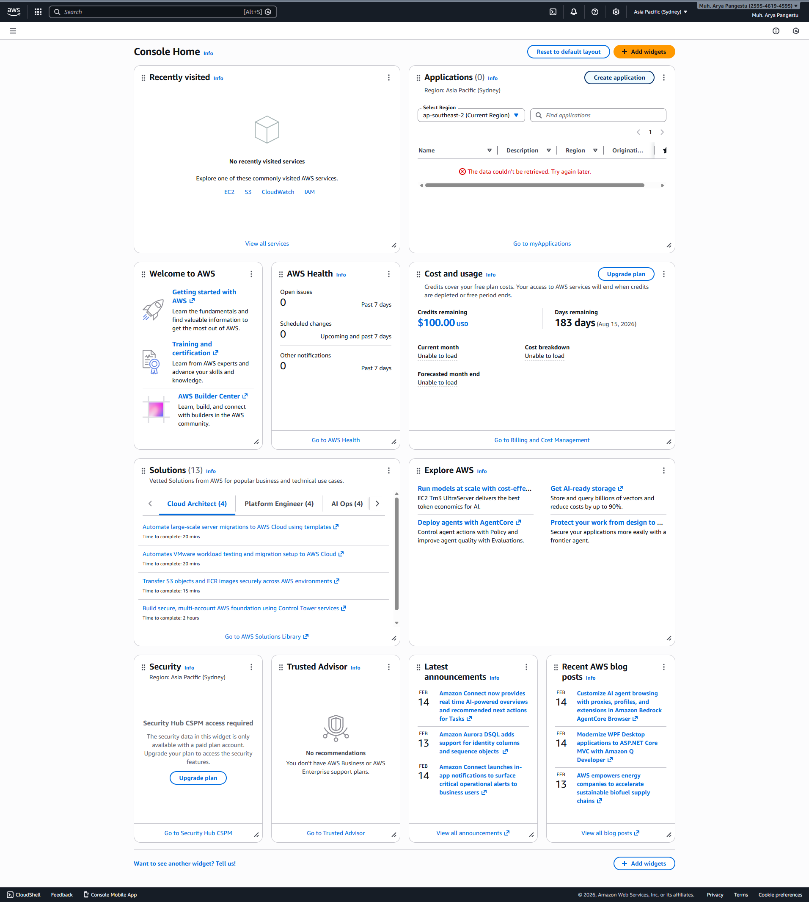

1. Buka laman resmi AWS https://aws.amazon.com/

2. Pilih Menu Create account

3. Isi email dan Nama akun Aws

4. Verify email Adress

5. Buat Password

6. Pilih yang free (6 month)

7. Mengisi Form Sign Up

8. Isi Credit Card (Bank Jago)

9. Confirmasi Identitas

10. Verifikasi identitas

11. Cek Kredit Aws

