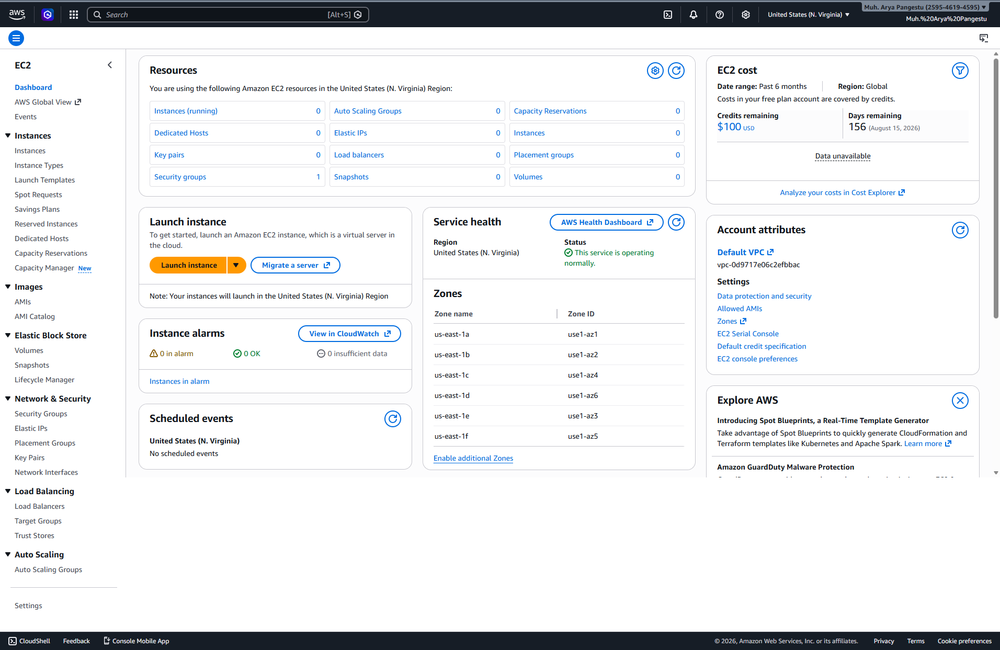
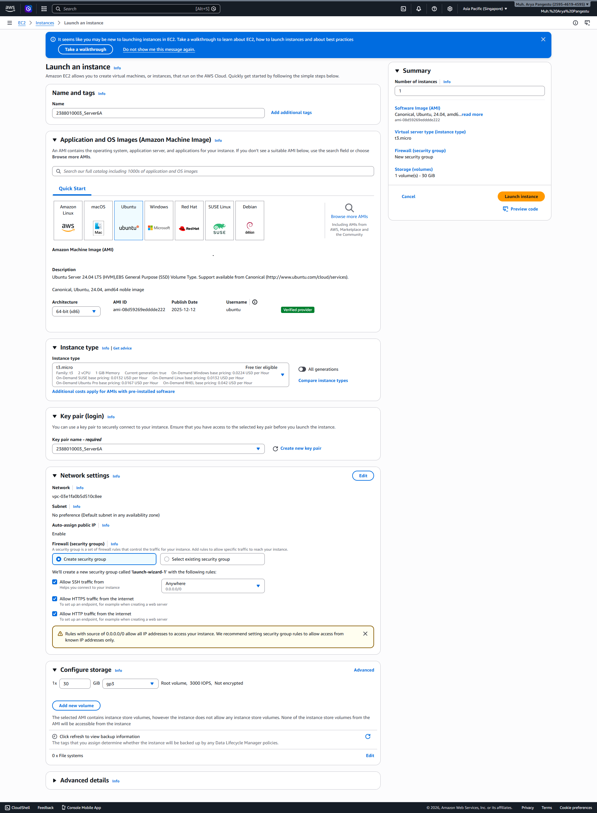
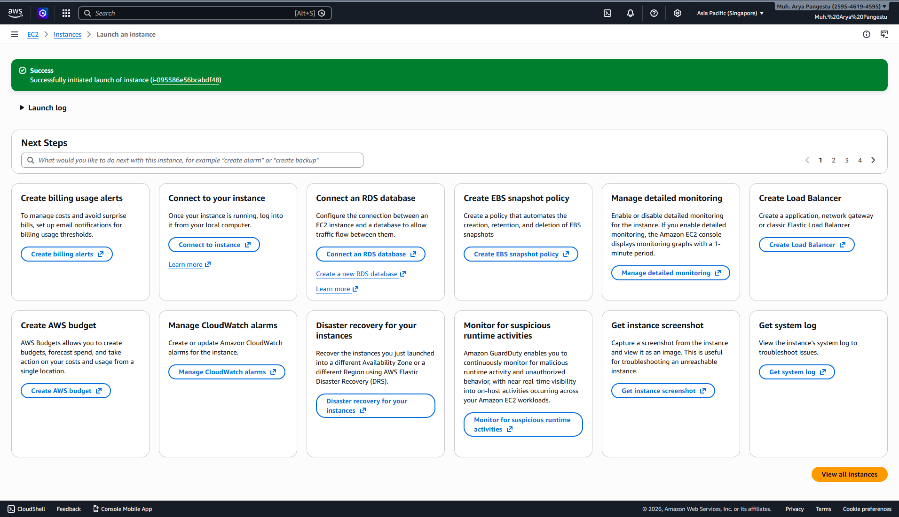
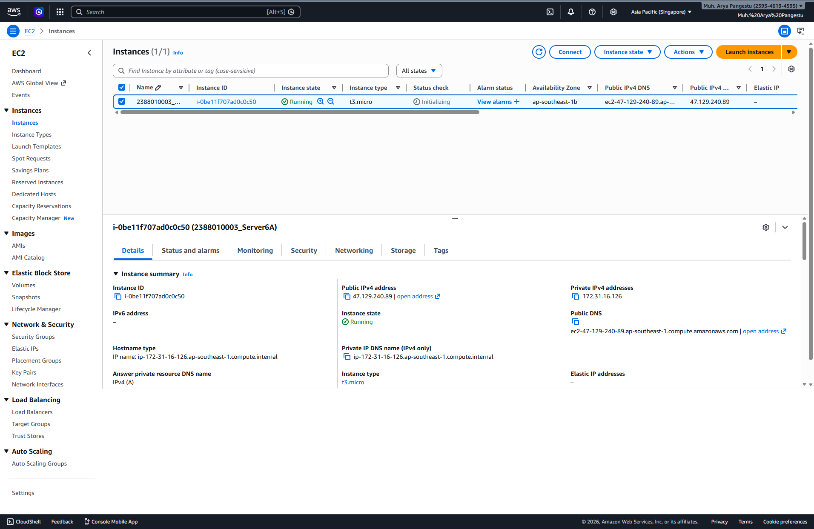

# Membuat VM / Instance di AWS EC2 dgn AMI

1. Buka Menu EC2 dari Dashboard

   
   
3. Klik Menu Launch Instance
4. Pastikan Region memilih terdekat
5. Isi Nama Instance -> NIM_Server6A
6. OS pilih Linux Ubuntu
7. Instance Type pilih T3.Micro
8. Membuat Key Pair -> Create new Key Pair -> Isi Nama -> file .Pem -> Create
9. Network Security

- Allow SSH Traffic
- Allow HTTPS
- Allow HTTP

9. Storage Setting -> 30Gb
10. Klik Launch Instance

   
    
11. Pastikan Alert Success

    
   
12. Pastikan nama sesuai -> klik Instance
    

